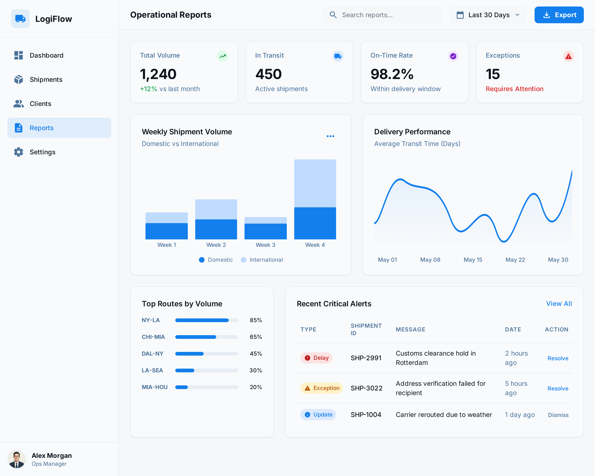
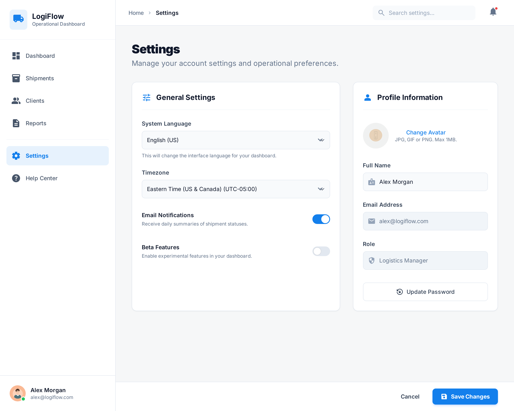

# LogiFlow – Frontend (Angular)

## 🎯 Propósito del Proyecto

Este repositorio corresponde al **frontend del producto LogiFlow**, desarrollado con **Angular**, y hace parte de los **aprendizajes complementarios definidos dentro de la ruta avanzada**, que el coder debe completar como parte de su proceso formativo en **riwi**.

El objetivo principal es que los coders aprendan a **construir un frontend profesional**, alineado a un diseño existente, aplicando buenas prácticas de arquitectura, componentización y desarrollo incremental.

> ⚠️ **Importante**  
> El diseño ya está definido.  
> El foco del trabajo **NO es diseñar pantallas**, sino **convertir diseño en código Angular de calidad**.

---

## 🧠 Contexto del Producto – LogiFlow

**LogiFlow** es una plataforma de gestión logística que permite a los equipos operativos:

- Visualizar el estado general de los envíos  
- Hacer seguimiento (tracking) de operaciones  
- Consultar información clave de clientes y reportes  
- Operar el día a día desde un dashboard centralizado  

El frontend representa un **panel operativo (Operations Dashboard)** típico de sistemas logísticos B2B.

---

## 🖼️ Diseño Base (Fuente de Verdad)

Las pantallas del producto fueron **generadas previamente utilizando**  
**https://stitch.withgoogle.com**, a partir de los requerimientos del producto y el contexto del negocio.

Estas pantallas representan el **diseño oficial del MVP** y funcionan como la **fuente de verdad visual** del frontend.

- El diseño es el **contrato visual** del producto  
- No debe ser modificado arbitrariamente  
- Sirve como referencia para:
  - Layout  
  - Componentes  
  - Estados visuales  
  - Jerarquía de información  

> ❌ No se debe copiar el HTML/CSS generado por Stitch  
> ✅ Se debe **interpretar el diseño y reconstruirlo en Angular**

### 🧠 Nota Importante

Stitch fue utilizado como **herramienta de generación visual**,  
pero el objetivo del proyecto **no es el diseño**, sino la **implementación técnica en Angular**.

Cada coder debe demostrar que puede:
- Leer un diseño existente  
- Identificar componentes reutilizables  
- Traducirlo a una arquitectura frontend profesional  

---

## 🧭 Vistas Oficiales del Producto (MVP)

Las siguientes son las **vistas oficiales** que deben implementarse respetando el diseño.

---

### 1️⃣ Dashboard

**Objetivo:**  
Brindar una visión general y rápida del estado del sistema logístico.

**Contiene:**
- Métricas clave (KPIs)
- Estados generales de envíos
- Mapa de seguimiento (visual)
- Tabla resumen de envíos recientes

**Diseño:**  

---

### 2️⃣ Shipments

**Objetivo:**  
Consultar y gestionar los envíos registrados en el sistema.

**Contiene:**
- Listado de envíos
- Estados (In Transit, Delivered, Incident)
- Información básica de origen, destino y cliente

**Diseño:**  

---

### 3️⃣ Track & Trace

**Objetivo:**  
Visualizar el seguimiento de envíos a lo largo de su recorrido.

**Contiene:**
- Vista de tracking (mapa o representación visual)
- Estados de ubicación

> En fases iniciales se trabaja con **mock data**.

**Diseño:**  

---

### 4️⃣ Customers

**Objetivo:**  
Consultar información básica de los clientes del sistema.

**Contiene:**
- Listado de clientes
- Información general (nombre, estado, relación con envíos)

**Diseño:**  

---

### 5️⃣ Reports

**Objetivo:**  
Visualizar reportes operativos del sistema.

**Contiene:**
- Información resumida
- Visualizaciones simples

> No se esperan reportes complejos en el MVP.

**Diseño:**  

---

### 6️⃣ Settings

**Objetivo:**  
Configuración general del sistema.

**Contiene:**
- Opciones de configuración (placeholder en MVP)

**Diseño:**  

---

## 🧱 Layouts del Frontend

El diseño define claramente un **layout principal**, que sirve como base para la mayoría de las vistas del sistema.

### 🧩 Main Layout

Este layout debe implementarse como la estructura base de la aplicación.

**Incluye:**
- Sidebar (navegación principal)
- Header (búsqueda, usuario, acciones)
- Área central de contenido (renderizada por routing)

Este layout será reutilizado por la mayoría de las vistas del sistema.

### 🛠️ Guía Angular
- Implementar un `MainLayoutComponent`
- Sidebar y Header como componentes independientes
- Usar `<router-outlet>` para renderizar las vistas
- Evitar duplicar layout por página

---

## 🧩 Componentes Base (UI Kit)

A partir del diseño, se identifican los siguientes **componentes reutilizables**, que conforman el **UI Kit del proyecto**:

- Sidebar  
- Header  
- Metric Card  
- Status Badge  
- Table  
- Map View  

Estos componentes deben ser:

- **Reutilizables**
- **Simples**
- **Enfocados en presentación**

> ⚠️ Los componentes del UI Kit **no deben contener lógica de negocio**,  
> solo recibir datos por inputs y emitir eventos básicos.

---

## 🛠️ Alcance Técnico Inicial

### ✅ Incluido
- Angular
- Componentes
- Templates
- Routing
- Mock data
- Buenas prácticas de estructura

### ❌ Fuera de alcance
- Backend real
- APIs reales
- Autenticación
- Roles y permisos
- Validaciones complejas

---

## 🧑‍💻 Forma de Trabajo Esperada

- El diseño **no se discute**, se implementa  
- Las decisiones de arquitectura deben poder justificarse  
- El código debe ser claro, ordenado y mantenible  
- El enfoque es **producto + aprendizaje**, no solo código  

> Este proyecto simula un entorno real de trabajo profesional.

---

## 🚀 Objetivo Formativo

Al finalizar esta fase, cada coder debería ser capaz de:

- Entender un diseño de producto  
- Traducirlo a una arquitectura Angular  
- Construir vistas claras y reutilizables  
- Trabajar con criterios profesionales de frontend  

---

**Bienvenidos al desarrollo del frontend de LogiFlow.**

Este proyecto no busca solo que el sistema funcione,  
sino que **pueda crecer sin romperse** 🚀
